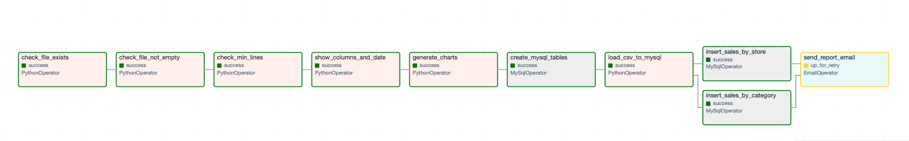

# Store Sales Pipeline

An Apache Airflow pipeline that validates store transaction data and generates sales analytics charts using Docker.

## Overview

This project runs a DAG (`validate_csv`) that:

1. **Checks if the CSV file exists** in the expected path
2. **Checks if the file is not empty**
3. **Validates minimum row count** (at least 2 lines)
4. **Displays column headers and date** from the first record
5. **Generates sales charts** (category sales, store sales, discount distribution, profit margins)



## Project Structure

```
sales_proj/
├── dags/
│   └── stores_dag.py              # Airflow DAG definition
├── script/
│   └── analysis_sales.py          # Sales analysis and chart generation
├── csv_files/
│   └── raw_store_transactions.csv # Source transaction data
├── sql_files/                     # SQL scripts
├── plugins/                       # Airflow plugins
├── logs/                          # Airflow logs
├── docker-compose-LocalExecutor.yml  # Docker Compose (MySQL + LocalExecutor)
├── docker-compose.yml                # Docker Compose (Postgres + LocalExecutor)
└── requirements.txt
```

## Dataset

The CSV file (`raw_store_transactions.csv`) contains store transaction records with the following columns:

| Column | Description |
|---|---|
| STORE_ID | Store identifier |
| STORE_LOCATION | Store city/location |
| PRODUCT_CATEGORY | Product category (Electronics, Furniture, Kitchen, etc.) |
| PRODUCT_ID | Product identifier |
| MRP | Maximum Retail Price |
| CP | Cost Price |
| DISCOUNT | Discount applied |
| SP | Selling Price |
| Date | Transaction date |

## Generated Charts

The analysis script produces four charts saved to `csv_files/results/`:

- `01_sales_by_category.png` - Total sales by product category
- `02_sales_by_store.png` - Total sales by store location
- `03_discount_distribution.png` - Distribution of discounts applied
- `04_profit_margin_by_category.png` - Average profit margin (SP - CP) by category

## Prerequisites

- [Docker](https://www.docker.com/)
- [Docker Compose](https://docs.docker.com/compose/install/)

## Getting Started

1. Start Docker Desktop

2. Run the containers:
   ```bash
   docker-compose -f docker-compose-LocalExecutor.yml up -d
   ```

3. Access the Airflow UI at [http://localhost:8080](http://localhost:8080)
   - **Username:** `admin`
   - **Password:** `admin`

4. Enable the `validate_csv` DAG and trigger a run

## Tech Stack

- **Apache Airflow 2.10.4** - Workflow orchestration
- **MySQL 8.0** - Airflow metadata database
- **Python** - DAG and analysis scripts
- **Pandas** - Data processing
- **Matplotlib** - Chart generation
- **Docker** - Containerization
